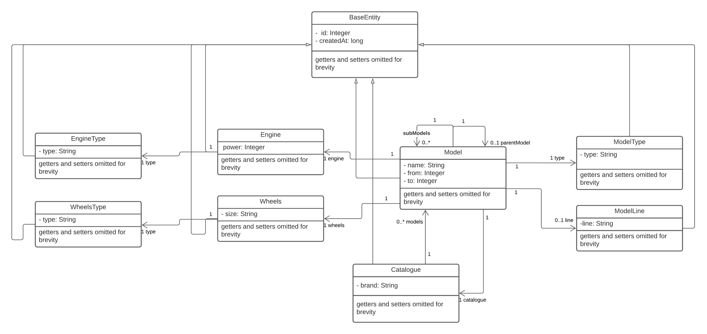

# Challenge answers

## A - The entities

## B - Ingest the data

- Loading ford-example.xml file into POJO-s using jackson-dataformat-xml 
- Map these POJO-s into entities
- Save entities on database using spring data repository

## C - Expose data with a RESTful API
exposed endpoints are:

- `/api/catalogue/{brand}/{sort}` return type `List<CarModelDTO>`
- `/model/{id}/features` return type `CarModelDTO`

## D - Adding images
Supposing there is an image tag which contains a base64 string inside MODEL type on ford-example.xml.
#### For Part B
- To add image file on B part first we should add a `byte[]` array field on entity class annotated with `@Lob`, 
then decode base64 string into byte array using `Base64.getDecoder().decode(base64ImageToDecode)`.
#### For Part C
For the part C may be two potential solution which we can implement. 
- Adding another controller `/api/model/{id}/{image}` to serve images and then referring to it from html like this `.
- Using base64, by encode image from database to base64 string using `Base64.getEncoder().encodeToString(imageDataFromDB)` and then setting into html like this `<img src='data:image/jpeg;base64,'+${base64EncodedImage}'`

## E - Improvements

 - In part C in the second service in case there is a lot of data it would be more efficient to implement pagination